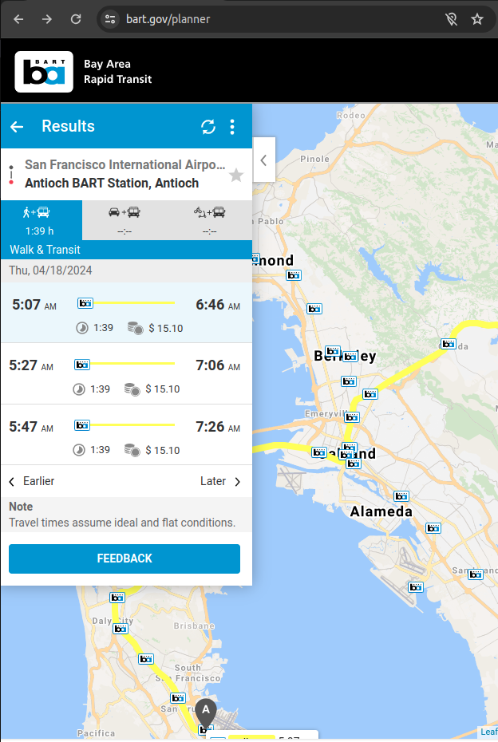
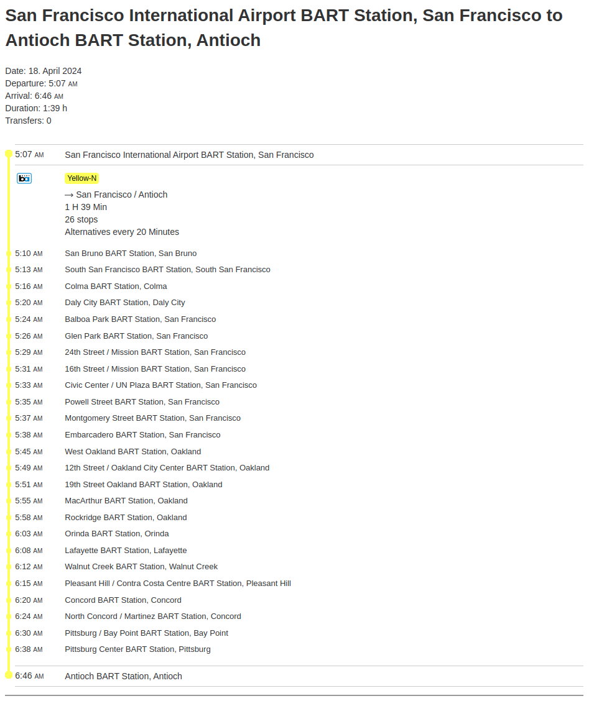
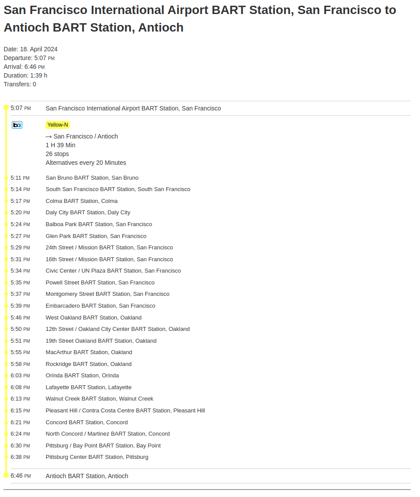
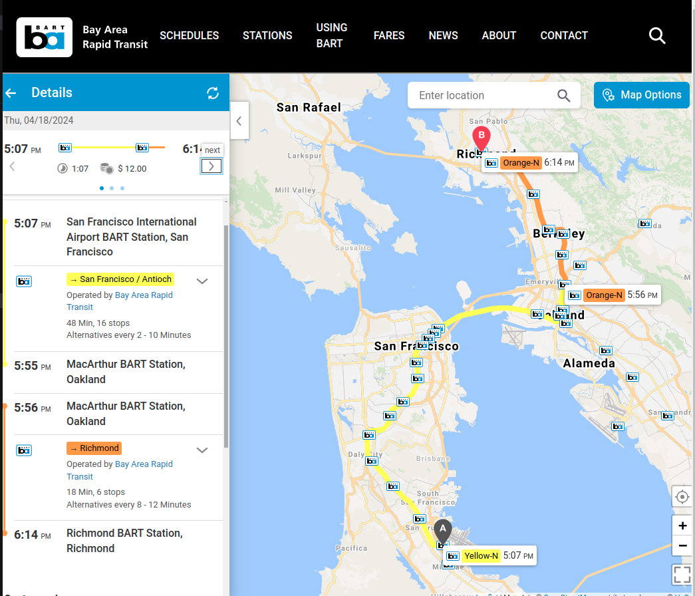
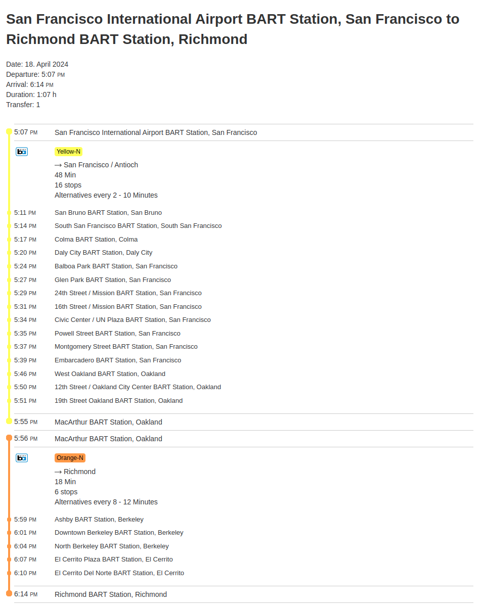

<!--
SPDX-FileCopyrightText: 2024 Adrian C. Prelipcean <adrianprelipceanc@gmail.com>

SPDX-License-Identifier: CC-BY-NC-SA-4.0
-->

# Intro to PGTFS

## What is PGTFS?

[PGTS](https://github.com/adrianprelipcean/pgtfs) is a PostgreSQL extension that allows you to create public transportation routes from GTFS data.

## This tutorial

In this tutorial, you will learn how to add a simple routing engine for the GTFS in [San Francisco](https://www.bart.gov/schedules) using only PostgreSQL and PGTFS. You will check those schedules against the official [BART planner](https://www.bart.gov/planner) . This tutorial assumes you are using a Unix system, although you can translate the instructions to the operating system of your choice, and have some experience working with Docker.

| Note: URL for accessing the data is http://www.bart.gov/dev/schedules/google_transit.zip and it was last accessed `2024/04/18 14:45+02`

### Part I: Set up the environment and download the data

1. Download the data using the following script

    ```sh
    wget http://www.bart.gov/dev/schedules/google_transit.zip -O data/san_francisco.zip
    ```

    | Alternatively, go to http://www.bart.gov/dev/schedules/google_transit.zip, download the archive and save it in the `data` folder. 

2. Unzip the data 

    ```sh
    unzip san_francisco.zip -d san_francisco
    ```

    | Alternatively, unzip it manually in a new directory `san_francisco` which should be under `data`

3. Create a new folder named `sql` and copy the file [init.sql](sql/init.sql) in it.

4. Copy the [Dockerfile](Dockerfile) into your root folder.

    Your working folder should contain the following:

    ```
    ├── data
    │   ├── san_francisco
    │   │   ├── agency.txt
    │   │   ├── calendar_attributes.txt
    │   │   ├── calendar_dates.txt
    │   │   ├── calendar.txt
    │   │   ├── directions.txt
    │   │   ├── fare_attributes.txt
    │   │   ├── fare_rider_categories.txt
    │   │   ├── fare_rules.txt
    │   │   ├── feed_info.txt
    │   │   ├── realtime_routes.txt
    │   │   ├── rider_categories.txt
    │   │   ├── route_attributes.txt
    │   │   ├── routes.txt
    │   │   ├── shapes.txt
    │   │   ├── stops.txt
    │   │   ├── stop_times.txt
    │   │   ├── transfers.txt
    │   │   └── trips.txt
    │   └── san_francisco.zip
    ├── Dockerfile
    └── sql
        └── init.sql
    ```

5. Now that you have all the data you need to proceed with this tutorial, go ahead and build the Docker image named `gtfs/san-francisco:1.0`. 

    ```sh
    docker build -t gtfs/san-francisco:1.0 . 
    ```

6. Create a `.env` file that contains the [following attributes](.env.example)

7. Start up a Docker container `gtfs-container` with port forwarding (15432 from your localhost forwarded to 5432 in the container) and with the `sql` and `data` folders attached.  

    ```sh
    docker run --name gtfs-container -d -p 15432:5432 --env-file=.env -v `pwd`/sql:/sql -v `pwd`/data:/data gtfs/san-francisco:1.0
    ```

    At this stage, the PostgreSQL container is up and running.

8. Create a new database `gtfs_san_francisco` which you will use for importing the data you downloaded previously. 

    ```sh
    docker exec gtfs-container psql --user postgres -c "CREATE DATABASE gtfs_san_francisco;"
    ```

    Followed by the following command to set the timezone of the database. This is needed so all `timestamptz` casts will be at the relevant time zone.

    ```sh
    docker exec gtfs-container psql --user postgres -c "ALTER DATABASE gtfs_san_francisco SET TIMEZONE TO 'US/Pacific';"
    ```


9. Run the initialization script on the `gtfs_san_francisco` database to create the core `GTFS` tables we will use in this tutorial. These tables contain the definitions for [stops](https://gtfs.org/schedule/reference/#stopstxt), [trips](https://gtfs.org/schedule/reference/#tripstxt) and [stop_times](https://gtfs.org/schedule/reference/#stop_timestxt).

    ```sh
    docker exec gtfs-container psql --dbname gtfs_san_francisco --user postgres -f sql/init.sql
    ```

10. Upload the relevant data from the downloaded GTFS feed for San Francisco in the database.

    ```sh
    docker exec gtfs-container psql --dbname gtfs_san_francisco --user postgres -c "\copy 
    gtfs.stops(
        stop_id,
        stop_code,
        stop_name,
        stop_desc,
        stop_lat,
        stop_lon,
        zone_id,
        stop_url,
        location_type,    
        parent_station

    ) FROM 
    '/data/san_francisco/stops.txt' DELIMITER ',' CSV HEADER;"
    ```

    ```sh
    docker exec gtfs-container psql --dbname gtfs_san_francisco --user postgres -c "\copy 
    gtfs.trips(
        route_id,
        service_id,
        trip_id,
        trip_headsign,
        direction_id,
        block_id,
        shape_id,    
        trip_short_name,
        wheelchair_accessible, 
        bikes_allowed
    )
    FROM '/data/san_francisco/trips.txt' DELIMITER ',' CSV HEADER;"
    ```

    ```sh
    docker exec gtfs-container psql --dbname gtfs_san_francisco --user postgres -c "\copy 
    gtfs.stop_times(
        trip_id,
        arrival_time,
        departure_time,
        stop_id,
        stop_sequence,
        stop_headsign,
        pickup_type,
        dropoff_type,
        shape_dist_traveled
    )
    FROM '/data/san_francisco/stop_times.txt' DELIMITER ',' CSV HEADER;"
    ```

11. Perform a sanity check by connecting to the database and verifying that it looks alright. 

    - Connect to the database

    ```sh   
    psql --host localhost --port 15432 --user postgres --dbname gtfs_san_francisco
    ```

    - List all tables in schema `gtfs`
    
    ```psql
    \dt+ gtfs.*
    ```

    Which should return something similar to 
    ```
                                        List of relations
    Schema |    Name    | Type  |  Owner   | Persistence | Access method |  Size  | Description 
    --------+------------+-------+----------+-------------+---------------+--------+-------------
    gtfs   | stop_times | table | postgres | permanent   | heap          | 11 MB  | 
    gtfs   | stops      | table | postgres | permanent   | heap          | 56 kB  | 
    gtfs   | trips      | table | postgres | permanent   | heap          | 1376 kB | 
    ```

    - Select some stop related information 

    ```sql
    SELECT stop_id, stop_name FROM gtfs.stops;
    ```

    Which should return something similar to     
    ```
    stop_id   |                       stop_name                        
    ------------+--------------------------------------------------------
    LAKE       | Lake Merritt
    FTVL       | Fruitvale
    COLS       | Coliseum
    SANL       | San Leandro
    BAYF       | Bay Fair
    HAYW       | Hayward
    SHAY       | South Hayward
    UCTY       | Union City
    FRMT       | Fremont
    ```

Congratulations on reaching this part of the tutorial, at this stage you have set up your environment and are ready to do some routing.

### Part II: Use the Connection Scan Algorithm (CSA) implemented by PGTFS

### Connection Scan Algorithm (CSA)

The Connection Scan Algorithm (CSA) efficiently handles queries in timetable information systems. It works by systematically scanning through the available timetable data to find connections that match the user's query criteria, such as departure and arrival times. Refer to the [original paper](https://arxiv.org/abs/1703.05997) for further information.

#### Intro to pgtfs_csa

`pgtfs_csa` is a function of the `PGTFS` PostgreSQL extension, which implements a version of the Connection Scan Algorithm (CSA) 

Since we already have all the data necessary, let's evaluate what we need to be able to utilize `pgtfs_csa`. The interface is very similar to that of `pgRouting`. 

```sql
CREATE OR REPLACE FUNCTION pgtfs_csa(
    origin TEXT,
    destination TEXT,
    departure_time DOUBLE PRECISION,
    network TEXT
)
RETURNS TABLE (
    stop_id TEXT,
    stop_sequence INT,
    arrival_time DOUBLE PRECISION,
    trip_id TEXT
);
```

The `departure_time` field is the unix epoch value of the reference time for the routing (usually set to `EXTRACT(EPOCH FROM NOW())`)

The `network` field is similar to the `Edges SQL` in the pgRouting [Dijkstra implementation](https://docs.pgrouting.org/latest/en/pgr_dijkstra.html#edges-sql), with a few differences. `network` expects the following format:
```sql
SELECT 
    trip_id, -- string  
    stop_id, -- string
    arrival_time, -- double precision
    departure_time, -- double precision
    stop_sequence -- integer
```

This is exactly the data we have in `gtfs.stop_times` with the main difference being the types of the arrival_time and departure_time, which are `INTERVAL` in the table, whereas the `pgtfs_csa` function expects the Unix epoch value (double precision).

```sql
CREATE TABLE IF NOT EXISTS gtfs.stop_times (
    trip_id TEXT,
    arrival_time INTERVAL,
    departure_time INTERVAL,
    stop_id TEXT,
    stop_sequence INTEGER,
    .....
)
```

Since the `INTERVAL` values are relative to the beginning of the day, we can convert them to Unix epoch using a `network` query similar to

```sql
SELECT 
    trip_id, stop_id AS from_stop_id, 
    EXTRACT(EPOCH FROM {reference_date} + arrival_time)::DOUBLE PRECISION AS arrival_time, 
    EXTRACT(EPOCH FROM {reference_date} + departure_time)::DOUBLE PRECISION AS departure_time,
    stop_sequence
FROM gtfs.stop_times;
```

#### Utilizing CSA for routing

1. Getting the route from `San Francisco International Airport` to `Antioch`

    We identify that the stop_ids are `SFIA` for `San Francisco International Airport` and `ANTC` for `Antioch` by running query similar to 

    ```sql
    SELECT stop_id, stop_name 
    FROM gtfs.stops
    WHERE stop_name ilike '%san francisco%' OR stop_name ilike 'antioch'
    LIMIT 5;
    ```

    Which returns 

    ```
        stop_id   |              stop_name              
    ------------+-------------------------------------
    ANTC       | Antioch
    SSAN       | South San Francisco
    SFIA       | San Francisco International Airport
    place_ANTC | Antioch
    place_SSAN | South San Francisco
    ```

    Knowing the stop ids, we want to get the route with the earliest arrival time that departs from `SFIA` with a destination at `ANTC`, that assumes that the departure time is `2024-04-18 05:00:00` at local time (Pacific time zone), which would translate to the following query (note that the arrival and departure time in the `network` query are now relative to the same date as that of the departure time)

    ```sql
    SELECT * FROM pgtfs_csa(
        'SFIA', 
        'ANTC', 
        EXTRACT(EPOCH FROM '2024-04-18 05:00:00'::timestamptz), 
        $$
        select 
            trip_id, 
            stop_id, 
            EXTRACT(EPOCH FROM ('2024-04-18'::date+arrival_time)::timestamptz)::double precision AS arrival_time, 
            EXTRACT(EPOCH FROM ('2024-04-18'::date+departure_time)::timestamptz)::double precision AS departure_time,
            stop_sequence
        FROM gtfs.stop_times;
        $$
    ) csa ;
    ```

    Which produces the following result:

    ```
    stop_id | stop_sequence | arrival_time | trip_id 
    ---------+---------------+--------------+---------
    SFIA    |             0 |   1713441536 | 
    SBRN    |             1 |   1713442176 | 1509073
    SSAN    |             2 |   1713442432 | 1509073
    COLM    |             3 |   1713442560 | 1509073
    DALY    |             4 |   1713442816 | 1509073
    BALB    |             5 |   1713443072 | 1509073
    GLEN    |             6 |   1713443200 | 1509073
    24TH    |             7 |   1713443328 | 1509073
    16TH    |             8 |   1713443456 | 1509073
    CIVC    |             9 |   1713443584 | 1509073
    POWL    |            10 |   1713443712 | 1509073
    MONT    |            11 |   1713443840 | 1509073
    EMBR    |            12 |   1713443840 | 1509073
    WOAK    |            13 |   1713444352 | 1509073
    12TH    |            14 |   1713444480 | 1509073
    19TH    |            15 |   1713444608 | 1509073
    MCAR    |            16 |   1713444864 | 1509073
    ROCK    |            17 |   1713445120 | 1509073
    ORIN    |            18 |   1713445376 | 1509073
    LAFY    |            19 |   1713445632 | 1509073
    WCRK    |            20 |   1713445888 | 1509073
    PHIL    |            21 |   1713446144 | 1509073
    CONC    |            22 |   1713446400 | 1509073
    NCON    |            23 |   1713446656 | 1509073
    PITT    |            24 |   1713447040 | 1509073
    PCTR    |            25 |   1713447424 | 1509073
    ANTC    |            26 |   1713447936 | 1509073
    ```

    While this is a route, it is not that easy to understand what is going on, so let's bring some clarity to it. Run the following query:

    ```sql
    SELECT 
        stop_sequence, csa.stop_id, csa.trip_id, 
        stop_name, trip_headsign, 
        to_timestamp(arrival_time) as arrival_time 
    FROM pgtfs_csa(
        'SFIA', 
        'ANTC', 
        EXTRACT(EPOCH from '2024-04-18 05:00:00'::timestamptz), 
        $$
        select 
            trip_id, 
            stop_id, 
            EXTRACT(EPOCH FROM ('2024-04-18'::date+arrival_time)::timestamptz)::double precision AS arrival_time, 
            EXTRACT(EPOCH FROM ('2024-04-18'::date+departure_time)::timestamptz)::double precision AS departure_time,
            stop_sequence
        FROM gtfs.stop_times
        $$
    ) csa 
    JOIN gtfs.stops st ON st.stop_id = csa.stop_id
    LEFT JOIN gtfs.trips t ON t.trip_id =csa.trip_id;
    ```

    Which returns the following human readable route 
    ```
    stop_sequence | stop_id | trip_id |              stop_name              |      trip_headsign      |      arrival_time      
    ---------------+---------+---------+-------------------------------------+-------------------------+------------------------
                0 | SFIA    |         | San Francisco International Airport |                         | 2024-04-18 04:58:56-07
                1 | SBRN    | 1509073 | San Bruno                           | San Francisco / Antioch | 2024-04-18 05:09:36-07
                2 | SSAN    | 1509073 | South San Francisco                 | San Francisco / Antioch | 2024-04-18 05:13:52-07
                3 | COLM    | 1509073 | Colma                               | San Francisco / Antioch | 2024-04-18 05:16:00-07
                4 | DALY    | 1509073 | Daly City                           | San Francisco / Antioch | 2024-04-18 05:20:16-07
                5 | BALB    | 1509073 | Balboa Park                         | San Francisco / Antioch | 2024-04-18 05:24:32-07
                6 | GLEN    | 1509073 | Glen Park                           | San Francisco / Antioch | 2024-04-18 05:26:40-07
                7 | 24TH    | 1509073 | 24th Street / Mission               | San Francisco / Antioch | 2024-04-18 05:28:48-07
                8 | 16TH    | 1509073 | 16th Street / Mission               | San Francisco / Antioch | 2024-04-18 05:30:56-07
                9 | CIVC    | 1509073 | Civic Center / UN Plaza             | San Francisco / Antioch | 2024-04-18 05:33:04-07
                10 | POWL    | 1509073 | Powell Street                       | San Francisco / Antioch | 2024-04-18 05:35:12-07
                11 | MONT    | 1509073 | Montgomery Street                   | San Francisco / Antioch | 2024-04-18 05:37:20-07
                12 | EMBR    | 1509073 | Embarcadero                         | San Francisco / Antioch | 2024-04-18 05:37:20-07
                13 | WOAK    | 1509073 | West Oakland                        | San Francisco / Antioch | 2024-04-18 05:45:52-07
                14 | 12TH    | 1509073 | 12th Street / Oakland City Center   | San Francisco / Antioch | 2024-04-18 05:48:00-07
                15 | 19TH    | 1509073 | 19th Street Oakland                 | San Francisco / Antioch | 2024-04-18 05:50:08-07
                16 | MCAR    | 1509073 | MacArthur                           | San Francisco / Antioch | 2024-04-18 05:54:24-07
                17 | ROCK    | 1509073 | Rockridge                           | San Francisco / Antioch | 2024-04-18 05:58:40-07
                18 | ORIN    | 1509073 | Orinda                              | San Francisco / Antioch | 2024-04-18 06:02:56-07
                19 | LAFY    | 1509073 | Lafayette                           | San Francisco / Antioch | 2024-04-18 06:07:12-07
                20 | WCRK    | 1509073 | Walnut Creek                        | San Francisco / Antioch | 2024-04-18 06:11:28-07
                21 | PHIL    | 1509073 | Pleasant Hill / Contra Costa Centre | San Francisco / Antioch | 2024-04-18 06:15:44-07
                22 | CONC    | 1509073 | Concord                             | San Francisco / Antioch | 2024-04-18 06:20:00-07
                23 | NCON    | 1509073 | North Concord / Martinez            | San Francisco / Antioch | 2024-04-18 06:24:16-07
                24 | PITT    | 1509073 | Pittsburg / Bay Point               | San Francisco / Antioch | 2024-04-18 06:30:40-07
                25 | PCTR    | 1509073 | Pittsburg Center                    | San Francisco / Antioch | 2024-04-18 06:37:04-07
                26 | ANTC    | 1509073 | Antioch                             | San Francisco / Antioch | 2024-04-18 06:45:36-07
    ```

    This is the same route that is identified as the earliest departure on [https://planner.bart.gov/](https://planner.bart.gov/) as shown in the below image. 

    

    Also, it contains the same stops and stop times as in the below image.

     

2. Getting the route from `San Francisco International Airport` to `Antioch` later in the day 

    This is pretty much the same query, with the only exception being the departure time which is now `17:00` instead of `05:00:00`. 

    ```sql
    SELECT 
        stop_sequence, csa.stop_id, csa.trip_id, 
        stop_name, trip_headsign, 
        to_timestamp(arrival_time) as arrival_time 
    FROM pgtfs_csa(
        'SFIA', 
        'ANTC', 
        EXTRACT(EPOCH from '2024-04-18 17:00:00'::timestamptz), 
        $$
        select 
            trip_id, 
            stop_id, 
            EXTRACT(EPOCH FROM ('2024-04-18'::date+arrival_time)::timestamptz)::double precision AS arrival_time, 
            EXTRACT(EPOCH FROM ('2024-04-18'::date+departure_time)::timestamptz)::double precision AS departure_time,
            stop_sequence
        FROM gtfs.stop_times;
        $$
    ) csa 
    JOIN gtfs.stops st ON st.stop_id = csa.stop_id
    LEFT JOIN gtfs.trips t ON t.trip_id =csa.trip_id;
    ```

    Which returns 

    ```
    stop_sequence | stop_id | trip_id |              stop_name              |      trip_headsign      |      arrival_time      
    ---------------+---------+---------+-------------------------------------+-------------------------+------------------------
                0 | SFIA    |         | San Francisco International Airport |                         | 2024-04-18 17:00:00-07
                1 | SBRN    | 1506650 | San Bruno                           | San Francisco / Antioch | 2024-04-18 17:10:40-07
                2 | SSAN    | 1506650 | South San Francisco                 | San Francisco / Antioch | 2024-04-18 17:12:48-07
                3 | COLM    | 1509040 | Colma                               | San Francisco / Antioch | 2024-04-18 17:17:04-07
                4 | DALY    | 1509040 | Daly City                           | San Francisco / Antioch | 2024-04-18 17:19:12-07
                5 | BALB    | 1509040 | Balboa Park                         | San Francisco / Antioch | 2024-04-18 17:23:28-07
                6 | GLEN    | 1506650 | Glen Park                           | San Francisco / Antioch | 2024-04-18 17:25:36-07
                7 | 24TH    | 1509040 | 24th Street / Mission               | San Francisco / Antioch | 2024-04-18 17:29:52-07
                8 | 16TH    | 1509040 | 16th Street / Mission               | San Francisco / Antioch | 2024-04-18 17:32:00-07
                9 | CIVC    | 1509040 | Civic Center / UN Plaza             | San Francisco / Antioch | 2024-04-18 17:34:08-07
                10 | POWL    | 1509040 | Powell Street                       | San Francisco / Antioch | 2024-04-18 17:34:08-07
                11 | MONT    | 1509040 | Montgomery Street                   | San Francisco / Antioch | 2024-04-18 17:36:16-07
                12 | EMBR    | 1506650 | Embarcadero                         | San Francisco / Antioch | 2024-04-18 17:38:24-07
                13 | WOAK    | 1506650 | West Oakland                        | San Francisco / Antioch | 2024-04-18 17:44:48-07
                14 | 12TH    | 1509040 | 12th Street / Oakland City Center   | San Francisco / Antioch | 2024-04-18 17:49:04-07
                15 | 19TH    | 1509040 | 19th Street Oakland                 | San Francisco / Antioch | 2024-04-18 17:51:12-07
                16 | MCAR    | 1509040 | MacArthur                           | San Francisco / Antioch | 2024-04-18 17:55:28-07
                17 | ROCK    | 1509040 | Rockridge                           | San Francisco / Antioch | 2024-04-18 17:57:36-07
                18 | ORIN    | 1509040 | Orinda                              | San Francisco / Antioch | 2024-04-18 18:04:00-07
                19 | LAFY    | 1509040 | Lafayette                           | San Francisco / Antioch | 2024-04-18 18:08:16-07
                20 | WCRK    | 1509040 | Walnut Creek                        | San Francisco / Antioch | 2024-04-18 18:12:32-07
                21 | PHIL    | 1509040 | Pleasant Hill / Contra Costa Centre | San Francisco / Antioch | 2024-04-18 18:14:40-07
                22 | CONC    | 1509040 | Concord                             | San Francisco / Antioch | 2024-04-18 18:21:04-07
                23 | NCON    | 1509040 | North Concord / Martinez            | San Francisco / Antioch | 2024-04-18 18:23:12-07
                24 | PITT    | 1509040 | Pittsburg / Bay Point               | San Francisco / Antioch | 2024-04-18 18:29:36-07
                25 | PCTR    | 1509040 | Pittsburg Center                    | San Francisco / Antioch | 2024-04-18 18:38:08-07
                26 | ANTC    | 1509040 | Antioch                             | San Francisco / Antioch | 2024-04-18 18:46:40-07
    ```

    Although this result might seem correct on a first glance, the `trip_id` jumps back and forth, which is mostly due to the fact that we did not consider the weekday vs weekend schedules. In this tutorial, we do not consisder the `calendar` entity which would contain weekened related information (you can think of how to embed it by reading the [GTFS documentation](https://gtfs.org/schedule/reference/)). However, since the column `service_id` of table `trips` contains verbose textual description (not just an id, but also the suffix `{id}-Weekday`), we can use it in our query to only consider weekday trips (since `2024-04-18` is a weekend)

    | Note: service_id containing the weekday information is a happy coincidence, this is not common and you should not expect it on other datasets.

    ```sql
    SELECT 
        stop_sequence, csa.stop_id, csa.trip_id, 
        stop_name, trip_headsign, 
        to_timestamp(arrival_time) as arrival_time 
    FROM pgtfs_csa(
        'SFIA', 
        'ANTC', 
        EXTRACT(EPOCH from '2024-04-18 17:00:00'::timestamptz), 
        $$
        select 
            trip_id, 
            stop_id, 
            EXTRACT(EPOCH FROM ('2024-04-18'::date+arrival_time)::timestamptz)::double precision AS arrival_time, 
            EXTRACT(EPOCH FROM ('2024-04-18'::date+departure_time)::timestamptz)::double precision AS departure_time,
            stop_sequence
        FROM gtfs.stop_times
        WHERE trip_id IN (SELECT trips.trip_id FROM gtfs.trips WHERE service_id ILIKE '%weekday%');
        $$
    ) csa 
    JOIN gtfs.stops st ON st.stop_id = csa.stop_id
    LEFT JOIN gtfs.trips t ON t.trip_id =csa.trip_id;
    ```

    Which now returns 

    ```
    stop_sequence | stop_id | trip_id |              stop_name              |      trip_headsign      |      arrival_time      
    ---------------+---------+---------+-------------------------------------+-------------------------+------------------------
                0 | SFIA    |         | San Francisco International Airport |                         | 2024-04-18 17:00:00-07
                1 | SBRN    | 1509040 | San Bruno                           | San Francisco / Antioch | 2024-04-18 17:10:40-07
                2 | SSAN    | 1509040 | South San Francisco                 | San Francisco / Antioch | 2024-04-18 17:14:56-07
                3 | COLM    | 1509040 | Colma                               | San Francisco / Antioch | 2024-04-18 17:17:04-07
                4 | DALY    | 1509040 | Daly City                           | San Francisco / Antioch | 2024-04-18 17:19:12-07
                5 | BALB    | 1509040 | Balboa Park                         | San Francisco / Antioch | 2024-04-18 17:23:28-07
                6 | GLEN    | 1509040 | Glen Park                           | San Francisco / Antioch | 2024-04-18 17:27:44-07
                7 | 24TH    | 1509040 | 24th Street / Mission               | San Francisco / Antioch | 2024-04-18 17:29:52-07
                8 | 16TH    | 1509040 | 16th Street / Mission               | San Francisco / Antioch | 2024-04-18 17:32:00-07
                9 | CIVC    | 1509040 | Civic Center / UN Plaza             | San Francisco / Antioch | 2024-04-18 17:34:08-07
                10 | POWL    | 1509040 | Powell Street                       | San Francisco / Antioch | 2024-04-18 17:34:08-07
                11 | MONT    | 1509040 | Montgomery Street                   | San Francisco / Antioch | 2024-04-18 17:36:16-07
                12 | EMBR    | 1509040 | Embarcadero                         | San Francisco / Antioch | 2024-04-18 17:38:24-07
                13 | WOAK    | 1509040 | West Oakland                        | San Francisco / Antioch | 2024-04-18 17:46:56-07
                14 | 12TH    | 1509040 | 12th Street / Oakland City Center   | San Francisco / Antioch | 2024-04-18 17:49:04-07
                15 | 19TH    | 1509040 | 19th Street Oakland                 | San Francisco / Antioch | 2024-04-18 17:51:12-07
                16 | MCAR    | 1509040 | MacArthur                           | San Francisco / Antioch | 2024-04-18 17:55:28-07
                17 | ROCK    | 1509040 | Rockridge                           | San Francisco / Antioch | 2024-04-18 17:57:36-07
                18 | ORIN    | 1509040 | Orinda                              | San Francisco / Antioch | 2024-04-18 18:04:00-07
                19 | LAFY    | 1509040 | Lafayette                           | San Francisco / Antioch | 2024-04-18 18:08:16-07
                20 | WCRK    | 1509040 | Walnut Creek                        | San Francisco / Antioch | 2024-04-18 18:12:32-07
                21 | PHIL    | 1509040 | Pleasant Hill / Contra Costa Centre | San Francisco / Antioch | 2024-04-18 18:14:40-07
                22 | CONC    | 1509040 | Concord                             | San Francisco / Antioch | 2024-04-18 18:21:04-07
                23 | NCON    | 1509040 | North Concord / Martinez            | San Francisco / Antioch | 2024-04-18 18:23:12-07
                24 | PITT    | 1509040 | Pittsburg / Bay Point               | San Francisco / Antioch | 2024-04-18 18:29:36-07
                25 | PCTR    | 1509040 | Pittsburg Center                    | San Francisco / Antioch | 2024-04-18 18:38:08-07
                26 | ANTC    | 1509040 | Antioch                             | San Francisco / Antioch | 2024-04-18 18:46:40-07
    ```

    And this now matches the itinerary from BART.

     

3. Getting the route from `San Francisco International Airport` to `Richmond`

    For this, we will just update the destination in the `pgtfs_csa` function to `RICH`
    ```sql
    SELECT 
        stop_sequence, csa.stop_id, csa.trip_id, 
        stop_name, trip_headsign, 
        to_timestamp(arrival_time) as arrival_time 
    FROM pgtfs_csa(
        'SFIA', 
        'RICH', 
        EXTRACT(EPOCH from '2024-04-18 17:00:00'::timestamptz), 
        $$
        select 
            trip_id, 
            stop_id, 
            EXTRACT(EPOCH FROM ('2024-04-18'::date+arrival_time)::timestamptz)::double precision AS arrival_time, 
            EXTRACT(EPOCH FROM ('2024-04-18'::date+departure_time)::timestamptz)::double precision AS departure_time,
            stop_sequence
        FROM gtfs.stop_times
        WHERE trip_id IN (SELECT trips.trip_id FROM gtfs.trips WHERE service_id ILIKE '%weekday%');
        $$
    ) csa 
    JOIN gtfs.stops st ON st.stop_id = csa.stop_id
    LEFT JOIN gtfs.trips t ON t.trip_id =csa.trip_id;
    ```

    Which now returns 

    ```
    stop_sequence | stop_id | trip_id |              stop_name              |      trip_headsign      |      arrival_time      
    ---------------+---------+---------+-------------------------------------+-------------------------+------------------------
                0 | SFIA    |         | San Francisco International Airport |                         | 2024-04-18 17:00:00-07
                1 | SBRN    | 1509040 | San Bruno                           | San Francisco / Antioch | 2024-04-18 17:10:40-07
                2 | SSAN    | 1509040 | South San Francisco                 | San Francisco / Antioch | 2024-04-18 17:14:56-07
                3 | COLM    | 1509040 | Colma                               | San Francisco / Antioch | 2024-04-18 17:17:04-07
                4 | DALY    | 1509040 | Daly City                           | San Francisco / Antioch | 2024-04-18 17:19:12-07
                5 | BALB    | 1509040 | Balboa Park                         | San Francisco / Antioch | 2024-04-18 17:23:28-07
                6 | GLEN    | 1509040 | Glen Park                           | San Francisco / Antioch | 2024-04-18 17:27:44-07
                7 | 24TH    | 1509040 | 24th Street / Mission               | San Francisco / Antioch | 2024-04-18 17:29:52-07
                8 | 16TH    | 1509040 | 16th Street / Mission               | San Francisco / Antioch | 2024-04-18 17:32:00-07
                9 | CIVC    | 1509040 | Civic Center / UN Plaza             | San Francisco / Antioch | 2024-04-18 17:34:08-07
                10 | POWL    | 1509040 | Powell Street                       | San Francisco / Antioch | 2024-04-18 17:34:08-07
                11 | MONT    | 1509040 | Montgomery Street                   | San Francisco / Antioch | 2024-04-18 17:36:16-07
                12 | EMBR    | 1509040 | Embarcadero                         | San Francisco / Antioch | 2024-04-18 17:38:24-07
                13 | WOAK    | 1509040 | West Oakland                        | San Francisco / Antioch | 2024-04-18 17:46:56-07
                14 | 12TH    | 1509040 | 12th Street / Oakland City Center   | San Francisco / Antioch | 2024-04-18 17:49:04-07
                15 | 19TH    | 1509040 | 19th Street Oakland                 | San Francisco / Antioch | 2024-04-18 17:51:12-07
                16 | MCAR    | 1509040 | MacArthur                           | San Francisco / Antioch | 2024-04-18 17:55:28-07
                17 | ASHB    | 1509233 | Ashby                               | OAK Airport / Richmond  | 2024-04-18 17:59:44-07
                18 | DBRK    | 1509233 | Downtown Berkeley                   | OAK Airport / Richmond  | 2024-04-18 18:01:52-07
                19 | NBRK    | 1509233 | North Berkeley                      | OAK Airport / Richmond  | 2024-04-18 18:04:00-07
                20 | PLZA    | 1509233 | El Cerrito Plaza                    | OAK Airport / Richmond  | 2024-04-18 18:06:08-07
                21 | DELN    | 1509233 | El Cerrito Del Norte                | OAK Airport / Richmond  | 2024-04-18 18:10:24-07
                22 | RICH    | 1509233 | Richmond                            | OAK Airport / Richmond  | 2024-04-18 18:14:40-07
    ```    

    There is a change of trips now, at the `MacArthur` staion, from `San Francisco / Antioch` to `OAK Airport / Richmond`, which also corresponds to the route provided by BART.

     

      

#### Drawbacks

This is a proof of concepts on how you could use PGTFS for routing using GTFS and does not consider all of the attributes that are commonly used when routing. For example, transfers between stops are not enforced, the time zone is hardcoded, etc.

Another drawback is the CSA algorithm, which is fairly simple and is an earliest arrival time algorithm. As such, it will not guarantee or enforce staying on the same trip.

Scalability was not of main concern in the current version (0.0.1), the limitting factor being the size of `stop_times`, while it works well with up to ~500k rows, it will likely see a severe performance drop after it.

## License 

All content is licensed under CC-BY-NC-SA-4.0 as shown in the [LICENCES](../LICENSES/) folder.