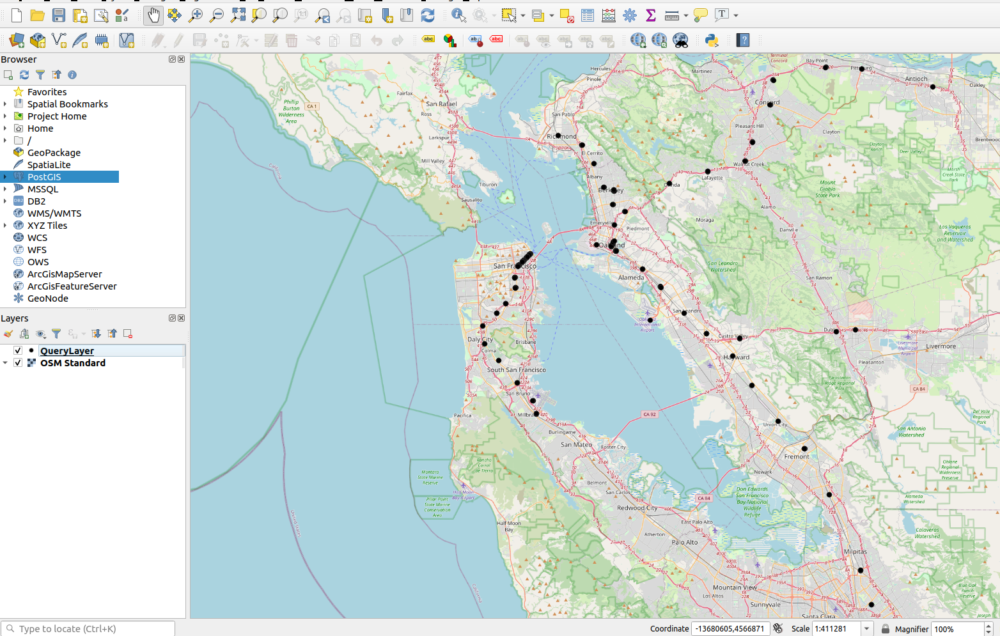

<!--
SPDX-FileCopyrightText: 2024 Adrian C. Prelipcean <adrianprelipceanc@gmail.com>

SPDX-License-Identifier: CC-BY-NC-SA-4.0
-->

# Visualizing PGTFS routes with PostGIS and QGIS 

## This tutorial

In this tutorial, you will extend what you have learned in the [previous tutorial](../001_pgtfs_csa/readme.md) by learning how to visualize the routes you created. You will use QGIS together with PostGIS and PGTFS and display the created routes on a map.


### Prerequisites 

You are expected to have finished the [introduction tutorial](../001_pgtfs_csa/readme.md). 
You will be using the same technology stack, with some notable differences: 
- the `Dockerfile` now extending the `postgis/postgis:16-3.4` image. If you utilize the same commands as in the previous tutorial, you will need to remove the previous Docker container (`docker rm gtfs-container`).
- `sql/init.sql` file has also been modified with the `CREATE EXTENSION IF NOT EXISTS postgis;` line. 
- you need to install QGIS from its [official website](https://www.qgis.org/en/site/forusers/download.html)

### Check your database is ready 

First, let's verify that the PGTFS extension is configured correctly. 

```sh
psql --host localhost --port 15432 --user postgres --dbname gtfs_san_francisco -c "select * from pgtfs_version()"
```

Which should return similar information to:

```
                            pgtfs_version
---------------------------------------------------------------------
Extension version: 0.0.1, PostgreSQL version: PostgreSQL 16.2 ....
```

Second, let's verify that the PostGIS extension is configured correctly. 

```sh
psql --host localhost --port 15432 --user postgres --dbname gtfs_san_francisco -c "select * from pgtfs_version()"
```

Which should return 

```
            postgis_version            
---------------------------------------
 3.4 USE_GEOS=1 USE_PROJ=1 USE_STATS=1
 ```

Now you are ready to proceed with the tutorial.

## Why QGIS and PostGIS? 

[QGIS](https://www.qgis.org/en/site/) is a free and open source Geographic Information System that is a great tool to use for visualizing geographic data. It has the added benefit of being able to connect directly to a PostgreSQL database and can display geometries that are generated by the PostGIS extension. With [PostGIS](https://postgis.net/), you can perform a large number of geometrical operations, index spatial data, etc. You will use PostGIS to build geometries from the routes you create with PGTFS, and then visualize them in QGIS. 


### Create a connection to your PostgreSQL database 

Within the browser pannel in QGIS, right click on PostGIS and select new connection. Enter the connection details for the Docker container we set up previously, and verify your connection is successful by pressing on `Test Connection`. 

You can use the details below for setting up the connection.

```
Name: GTFS San Francisco 
Host: localhost
Port: 15432
Database: gtfs_san_francisco
Username: {the user you set up in the .env file}
Password: {the password you set up in the .env file}
```

See the following screenshot for more details:


### Add a basemap 

A basemap is what you usually see when you use any map based service, it's a set of tiles that represent the world rendered in a coordinate system. The most common basemap in open source is using Open Street Map ([OSM](https://www.openstreetmap.org/))

To add a basemap, you can use the `QuickMapServices`, which you can download by going to `Plugins -> Manage and Install Plugins`, type in `QuickMapServices` followed by `Install`. 

After you install the plugin, you can access it by `Web -> QuickMapServices -> OSM -> OSM Standard`

If you followed the steps correctly, you would see something similar to:

 

Having this basemap in the background is going to add the spatial context to the routes you will display next.

## Visualize the stops 

A good first task is to add the stops from the database to a map. 

To be able to visualize the stops, we'll need to perform the following steps:
1. Connect to the PostgreSQL database
2. Write the query that retrieves the stops and their geometries
3. Display the retrieved stops on the map

First, you can go to `Database -> DB Manager -> PostGIS -> GTFS San Francisco` and click on the `SQL Window` icon, which will bring up an SQL Editor. You can type in the following query in it.

```sql
SELECT *, st_setsrid(st_makepoint(stop_lon, stop_lat),4326) AS geom
FROM gtfs.stops;
```

This selects everything from within the `gtfs.stops` table, and utilizes PostGIS to first create a point (with [ST_MAKEPOINT()](https://postgis.net/docs/ST_MakePoint.html)) and then to add the metadata of the reference system that the point is created in (with [ST_SETSRID()](https://postgis.net/docs/ST_SetSRID.html)) Since we are using latitude and longitude, the SRID for the geometry will be `4326` (WGS 84 geodetic -> you can read more about it [here](https://postgis.net/docs/using_postgis_dbmanagement.html#spatial_ref_sys))

This will bring up a set of rows, that you can then load into the map by specifying the correct geometry column (`geom`)


After you press on `Load`, you should see a map with all the stops in the database. Note that you might see other randomly generated colour for the stops when they are drawn on the map.



## Visualizing a simple route 

Now that you can visualize the stops, the next step is to visualize a route. You already have the following query from the previous tutorial, which returns the route between San Francisco Airport and Antioch. 

```sql
    SELECT 
        stop_sequence, csa.stop_id, csa.trip_id, 
        stop_name, trip_headsign, 
        to_timestamp(arrival_time) as arrival_time 
    FROM pgtfs_csa(
        'SFIA', 
        'ANTC', 
        EXTRACT(EPOCH from '2024-04-18 17:00:00'::timestamptz), 
        $$
        select 
            trip_id, 
            stop_id, 
            EXTRACT(EPOCH FROM ('2024-04-18'::date+arrival_time)::timestamptz)::double precision AS arrival_time, 
            EXTRACT(EPOCH FROM ('2024-04-18'::date+departure_time)::timestamptz)::double precision AS departure_time,
            stop_sequence
        FROM gtfs.stop_times
        WHERE trip_id IN (SELECT trips.trip_id FROM gtfs.trips WHERE service_id ILIKE '%weekday%');
        $$
    ) csa 
    JOIN gtfs.stops st ON st.stop_id = csa.stop_id
    LEFT JOIN gtfs.trips t ON t.trip_id =csa.trip_id;
```

However, you can't utilize it, since it is missing a geometry. You'll need to use PostGIS to create a geometry for it. However, in the last query we created a `point` geometry, whereas the route needs a line geometry. The [ST_MAKELINE()](https://postgis.net/docs/ST_MakeLine.html) function can be used to create a line between two or more points. This can be combined with a [window function](https://www.postgresql.org/docs/current/tutorial-window.html) that allows you to perform operations on multiple rows that are related within the context of a window. In this case, the window contains the ordered sequence of points for the route, and is used to get the geometry of each stop on the route and the next stop on the route. The query looks like this: 

```sql
WITH gtfs_route AS (
    SELECT 
        stop_sequence, csa.stop_id, csa.trip_id, 
        stop_name, trip_headsign, 
        to_timestamp(arrival_time) as arrival_time,
		st_setsrid(st_makepoint(stop_lon, stop_lat),4326) as geom
    FROM pgtfs_csa(
        'SFIA', 
        'ANTC', 
        EXTRACT(EPOCH from '2024-04-18 17:00:00'::timestamptz), 
        $$
        select 
            trip_id, 
            stop_id, 
            EXTRACT(EPOCH FROM ('2024-04-18'::date+arrival_time)::timestamptz)::double precision AS arrival_time, 
            EXTRACT(EPOCH FROM ('2024-04-18'::date+departure_time)::timestamptz)::double precision AS departure_time,
            stop_sequence
        FROM gtfs.stop_times
        WHERE trip_id IN (SELECT trips.trip_id FROM gtfs.trips WHERE service_id ILIKE '%weekday%');
        $$
    ) csa 
    JOIN gtfs.stops st ON st.stop_id = csa.stop_id
    LEFT JOIN gtfs.trips t ON t.trip_id =csa.trip_id
)
SELECT 
	stop_sequence, 
	stop_id, 
	trip_id, 
    stop_name, 
	trip_headsign, 
    arrival_time, 
	st_makeline(geom, lead(geom) OVER (ORDER BY stop_sequence)) AS geom
FROM gtfs_route 
ORDER BY stop_sequence
```

You should see something similar to the screenshot below in QGIS


You can go ahead and format the display of the line in QGIS until it matches your expectations.

## Visualizing a complex route

Now let's visualize a route that has more than one trip. You can repurpose the San Francisco Airport to Richmond route, which included two trips. 

```sql
WITH gtfs_route AS (
    SELECT 
        stop_sequence, csa.stop_id, csa.trip_id, 
        stop_name, trip_headsign, 
        to_timestamp(arrival_time) as arrival_time,
		st_setsrid(st_makepoint(stop_lon, stop_lat),4326) as geom
    FROM pgtfs_csa(
        'SFIA', 
        'RICH', 
        EXTRACT(EPOCH from '2024-04-18 17:00:00'::timestamptz), 
        $$
        select 
            trip_id, 
            stop_id, 
            EXTRACT(EPOCH FROM ('2024-04-18'::date+arrival_time)::timestamptz)::double precision AS arrival_time, 
            EXTRACT(EPOCH FROM ('2024-04-18'::date+departure_time)::timestamptz)::double precision AS departure_time,
            stop_sequence
        FROM gtfs.stop_times
        WHERE trip_id IN (SELECT trips.trip_id FROM gtfs.trips WHERE service_id ILIKE '%weekday%');
        $$
    ) csa 
    JOIN gtfs.stops st ON st.stop_id = csa.stop_id
    LEFT JOIN gtfs.trips t ON t.trip_id =csa.trip_id
)
SELECT 
	stop_sequence, 
	stop_id, 
	coalesce(trip_id, lead(trip_id) OVER (ORDER BY stop_sequence)) AS trip_id, 
    stop_name, 
	trip_headsign, 
    arrival_time, 
	st_makeline(geom, lead(geom) OVER (ORDER BY stop_sequence)) AS geom
FROM gtfs_route 
ORDER BY stop_sequence
```

The problem with this visualization is that it is not clear where one trip ends and the other begins (the transfer) since the displayed route shows both trips with the same colour. 


We can fix that by styling the route in QGIS. To do this, you can right click the layer you just added, select `Symbology` and apply a `Categorized` legend that displays the line segments belonging to different trips with differen colours. 


Which makes it a bit clearer to visualize.


## Adding the arrival time at each stop as a label

While seeing the trips with different colours is useful, it would be better to also show the stop names and the arrival times as a label. To do this, you can again utilize the styling capabilities of QGIS. First, rewrite the query to retrieve the stops along a route, as well as a suitable label in the format `STOP_NAME - ETA`.

```sql
WITH gtfs_route as (
    SELECT 
        stop_sequence, csa.stop_id, csa.trip_id, 
        stop_name, trip_headsign, 
        to_timestamp(arrival_time) as arrival_time,
		st_setsrid(st_makepoint(stop_lon, stop_lat),4326) as geom
    FROM pgtfs_csa(
        'SFIA', 
        'RICH', 
        EXTRACT(EPOCH from '2024-04-18 17:00:00'::timestamptz), 
        $$
        select 
            trip_id, 
            stop_id, 
            EXTRACT(EPOCH FROM ('2024-04-18'::date+arrival_time)::timestamptz)::double precision AS arrival_time, 
            EXTRACT(EPOCH FROM ('2024-04-18'::date+departure_time)::timestamptz)::double precision AS departure_time,
            stop_sequence
        FROM gtfs.stop_times
        WHERE trip_id IN (SELECT trips.trip_id FROM gtfs.trips WHERE service_id ILIKE '%weekday%');
        $$
    ) csa 
    JOIN gtfs.stops st ON st.stop_id = csa.stop_id
    LEFT JOIN gtfs.trips t ON t.trip_id =csa.trip_id
)
SELECT 
	stop_sequence, 
	stop_id, 
	trip_id, 
    stop_name, 
	trip_headsign, 
    arrival_time, 
	geom,
    stop_name || ' - ' || to_char(arrival_time, 'HH24:MI') AS label
FROM gtfs_route 
```

Then, utilize the `Labels` tab (you can access it by right clicking the new stop layer that you added, and going to layer properties) and add `Single labels` which have as value the `label` field you wrote above. Also, you can add a background to the label to make it easier to visualize on the map.


This map is now easier to understand. It is clear that the route contains a trip change at MacArthur at around `17:55` and that the arrival time at Richmond is `18:14`.


This was it for this tutorial, now you are able to also visualize the routes you create using GTFS feeds. 

## License 

All content is licensed under CC-BY-NC-SA-4.0 as shown in the [LICENCES](../LICENSES/) folder.